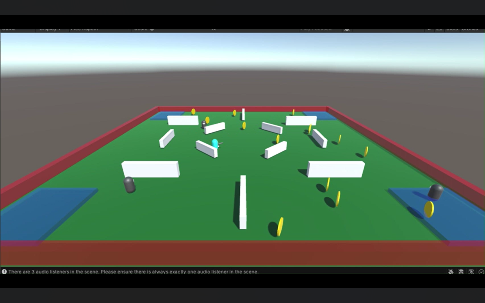

# Unity AI ML Agent: Zombie Slayer

## Overview
This project demonstrates a Unity-based AI agent trained using **ML-Agents** to navigate an environment, fight zombies, and collect coins. The agent learns to balance combat and reward collection in a dynamic environment, optimizing its actions for survival and point accumulation.

In this version:
- The agent moves freely across the area.
- Coins spawn randomly across the ground.
- Zombies roam the environment as threats.
- The agent gains rewards by collecting coins and eliminating zombies.

## Features
- **Autonomous Navigation:** The agent can move around freely to reach objectives.
- **Combat System:** Attack and defeat zombies to prevent damage.
- **Coin Collection:** Collect coins scattered throughout the environment for additional rewards.
- **Dynamic Environment:** Randomly spawning coins and moving zombies provide a varied training scenario.
- **Reward System:** Encourages the agent to balance combat efficiency with coin collection.

## How It Works
The AI agent uses reinforcement learning to maximize cumulative reward. Its reward function includes:
- Positive reward for killing zombies.
- Positive reward for collecting coins.
- Possible negative reward for taking damage or failing objectives.

Training occurs inside Unity using the **ML-Agents Toolkit**, with the environment reset after each episode to allow continuous learning.

## Setup & Installation
1. Clone or download the project.
2. Install [Unity Hub](https://unity.com/) and open the project using a supported Unity version.
3. Ensure the [ML-Agents Toolkit](https://github.com/Unity-Technologies/ml-agents) is installed.
4. Configure the `Behavior Parameters` on the agent.
5. Start training via the **ML-Agents training script**:
   ```bash
   mlagents-learn config/trainer_config.yaml --run-id=ZombieCollector_001

## Sceenshots



[Watch Training Video](Assets/Videos/training.mp4)
